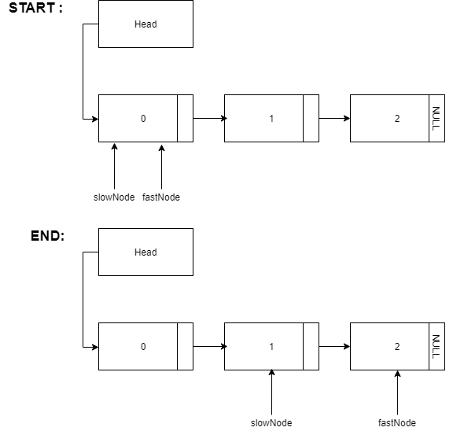

# Find Middle of a Given List
## Problem
Given a singly linked list, i neeeded to find the middle of the linked list. 
> Linked list is 0->1->2 then output should be 1.

If there are even nodes, that means that it would be two middle nodes, so I needed to print the second middle node.
> Linked list is 1->2->3->4->5->6 then output should be 4.

## Solution
With the use of two node pointers (slownNode and fastNode) I can find the middle of the given list only using one loop. This result it's reached by make de fastNode jump twice the lenght of the slowNode.
In other words, every time the slowNode jumps a node in the list the fastNode jumps two. When the fastNode reaches the end the slowNode will be exactly in the middle of the list.

</img>

## Language
&bullet; C

